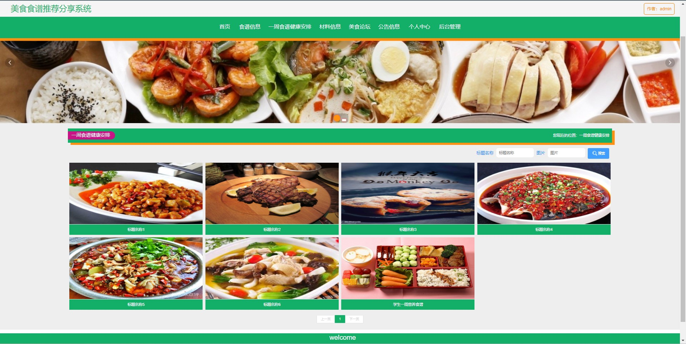
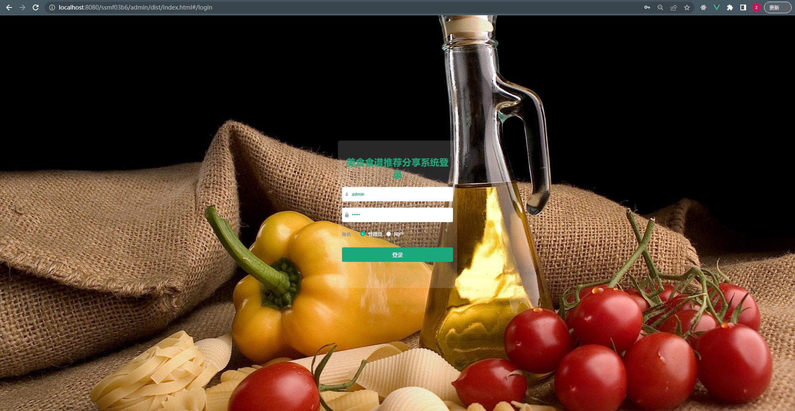
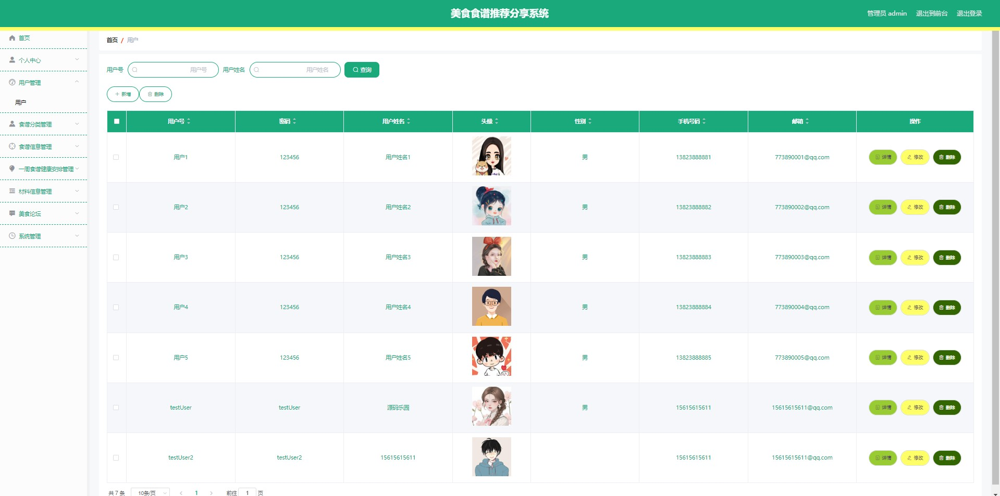
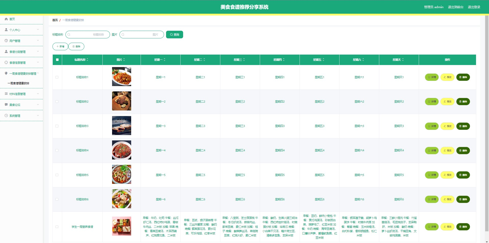
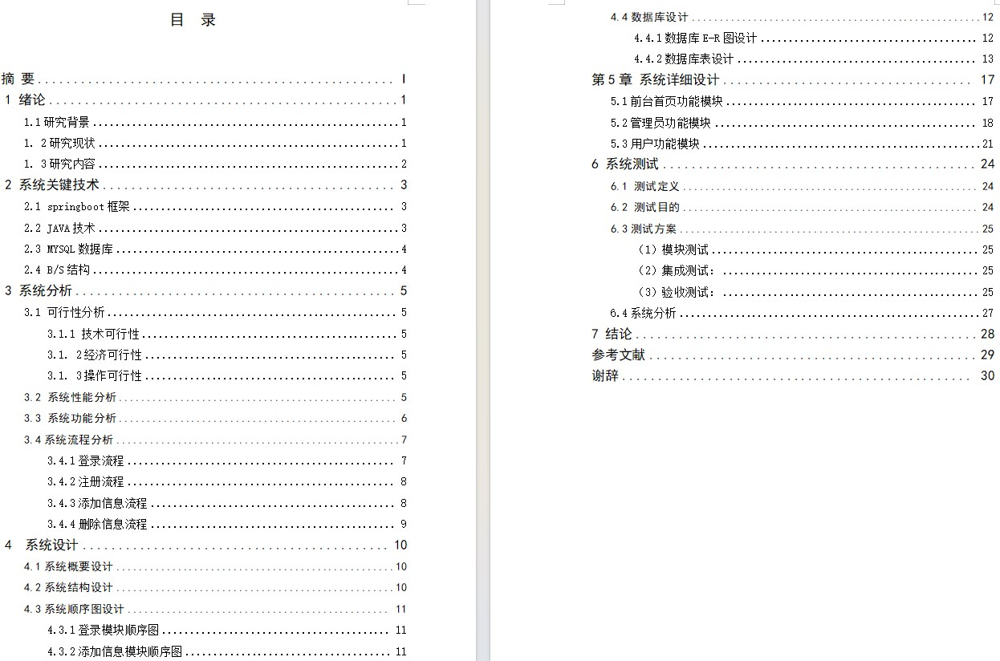
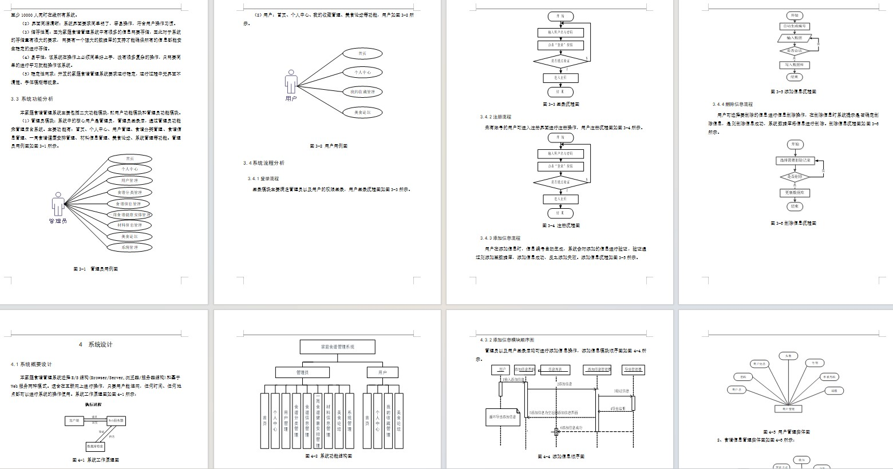

# 美食食谱分享推荐系统

### 9.9￥ 获取完整源码+sql，附赠11000字论文参考，需要的加Q：3808981644 备用Q：3577148218
### 有问题，或者需要协助调试运行项目的也可联系
### 获取更多项目，关注公众号：编程项目集

## 一、介绍

运行环境:idea或eclipse 数据库:mysql

开发语言：java

技术栈：springboot、mybatisplus、vue、html

角色分为管理员、用户

用户功能

注册、登录、首页、食谱信息、一周食谱健康安排、材料信息、美食论坛、公告信息、个人中心、我的发布、我的收藏

管理员功能

登录、首页、食谱信息、一周食谱健康安排、材料信息、美食论坛、公告信息、个人中心、我的发布、我的收藏

## 二、部分页面截图展示

## 三、11000字论文参考

### 9.9￥ 获取完整源码+sql，附赠11000字论文参考，需要的加Q：3808981644 备用Q：3577148218
### 有问题，或者需要协助调试运行项目的也可联系

